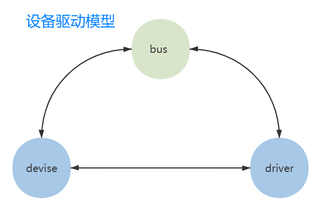
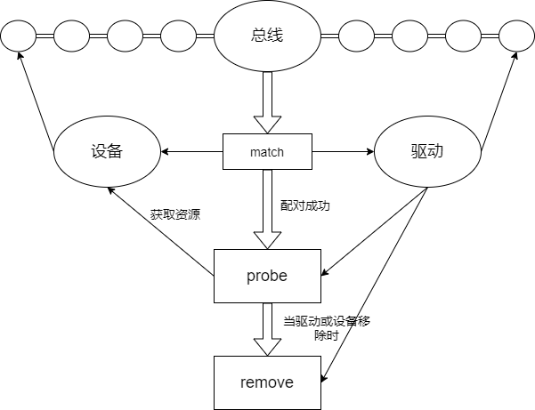
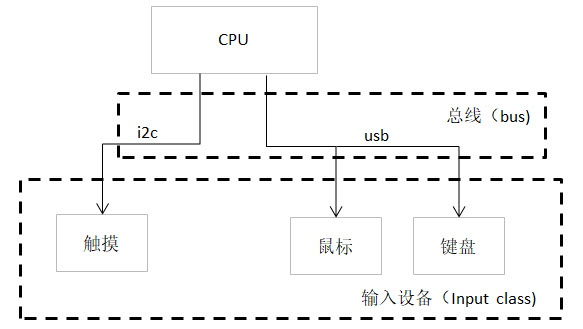
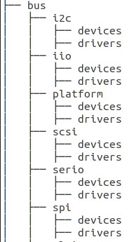
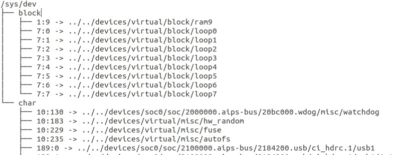
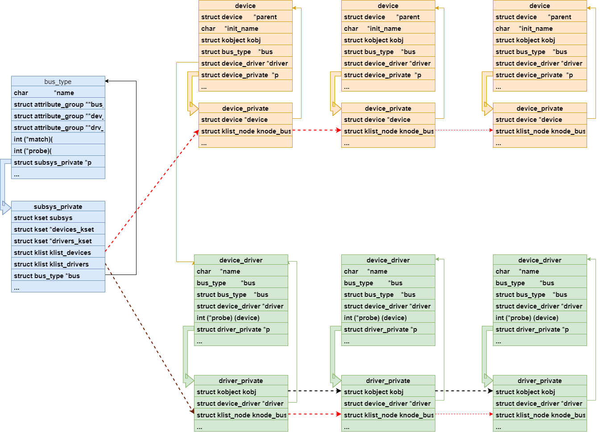
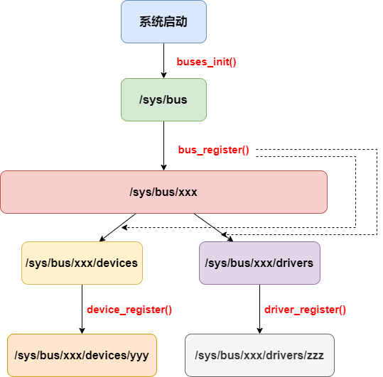

# Linux的设备模型

在前面写的驱动中，我们发现编写驱动有个固定的模式只有往里面套代码就可以了，它们之间的大致流程可以总结如下：

- 实现入口函数xxx_init()和卸载函数xxx_exit()
- 申请设备号 register_chrdev_region()
- 初始化字符设备，cdev_init函数、cdev_add函数
- 硬件初始化，如时钟寄存器配置使能，GPIO设置为输入输出模式等。
- 构建file_operation结构体内容，实现硬件各个相关的操作
- 在终端上使用mknod根据设备号来进行创建设备文件(节点)或者自动创建 (驱动使用class_create创建设备类、在类的下面device_create创建设备节点)

因此，在Linux开发驱动，只要能够掌握了这些“套路”，开发一个驱动便不是难事。在内核源码的drivers中存放了大量的设备驱动代码， 在我们写驱动之前先查看这里的内容，说不定可以在这些目录找到想要的驱动代码。如图所示：


只要这样根据步骤来编写我们的驱动代码简单粗暴，但是这存在着问题，我们将硬件的信息都写进了驱动里了， 根据某个硬件编写的驱动只要修改了一下引脚接口，这个驱动代码就得重新修改才能使用，这显然是不合理的， 那有没有合适的解决方案呢？答案是肯定的，Linux引入了设备驱动模型分层的概念， 将我们编写的驱动代码分成了两块：设备与驱动。设备负责提供硬件资源而驱动代码负责去使用这些设备提供的硬件资源。 并由总线将它们联系起来。这样子就构成以下图形中的关系。



设备模型通过几个数据结构来反映当前系统中总线、设备以及驱动的工作状况，提出了以下几个重要概念：

- **设备(device)** ：挂载在某个总线的物理设备；
- **驱动(driver)** ：与特定设备相关的软件，负责初始化该设备以及提供一些操作该设备的操作方式；
- **总线(bus)** ：负责管理挂载对应总线的设备以及驱动；
- **类(class)** ：对于具有相同功能的设备，归结到一种类别，进行分类管理；

我们知道在Linux中一切皆“文件”，在根文件系统中有个/sys文件目录，里面记录各个设备之间的关系。 下面介绍/sys下几个较为重要目录的作用。

/sys/bus目录下的每个子目录都是注册好了的总线类型。这里是设备按照总线类型分层放置的目录结构， 每个子目录(总线类型)下包含两个子目录——devices和drivers文件夹；其中devices下是该总线类型下的所有设备， 而这些设备都是符号链接，它们分别指向真正的设备(/sys/devices/下)；如下图bus下的usb总线中的device则是Devices目 录下/pci()/dev 0:10/usb2的符号链接。而drivers下是所有注册在这个总线上的驱动，每个driver子目录下 是一些可以观察和修改的driver参数。

/sys/devices目录下是全局设备结构体系，包含所有被发现的注册在各种总线上的各种物理设备。一般来说， 所有的物理设备都按其在总线上的拓扑结构来显示。/sys/devices是内核对系统中所有设备的分层次表达模型， 也是/sys文件系统管理设备的最重要的目录结构。

/sys/class目录下则是包含所有注册在kernel里面的设备类型，这是按照设备功能分类的设备模型， 我们知道每种设备都具有自己特定的功能，比如：鼠标的功能是作为人机交互的输入，按照设备功能分类无论它 挂载在哪条总线上都是归类到/sys/class/input下。


将它们统一起来就形成了上面的拓扑图，记录着设备与设备之间的关系。而我们这章的重心则放在bus文件夹目录下，创建自己的总线类型以及devices和drivers。

了解上面设备与设备的拓扑图之后，让我们再回来“总线-设备-驱动”模型中来。“总线-设备-驱动”它们之间是如何相互配合工作的呢？



在总线上管理着两个链表，分别管理着设备和驱动，当我们向系统注册一个驱动时，便会向驱动的管理链表插入我们的新驱动， 同样当我们向系统注册一个设备时，便会向设备的管理链表插入我们的新设备。在插入的同时总线会执行一个bus_type结构体中match的方法对新插入的设备/驱动进行匹配。 (它们之间最简单的匹配方式则是对比名字，存在名字相同的设备/驱动便成功匹配)。 在匹配成功的时候会调用驱动device_driver结构体中probe方法(通常在probe中获取设备资源，具体的功能可由驱动编写人员自定义)， 并且在移除设备或驱动时，会调用device_driver结构体中remove方法。

以上只是设备驱动模型的 **机制** ，上面的match、probe、remove等方法需要我们来实现需要的功能。看到这里相信我们都已经对设备驱动模型有了粗略的整体认识。 无论以后学习平台设备驱动、块设备驱动或者是其他总线设备，都跟Linux设备模型息息相关。sysfs文件系统用于把内核的设备驱动导出到用户空间， 用户便可通过访问sys目录及其下的文件，来查看甚至控制内核的一些驱动设备。 接下来对总线、驱动、设备进行进一步的了解了，具体了解如何使用代码来实现创建自己的总线并在自己的总线上创建设备及驱动。 同时也可以将我们驱动的某个控制变量，导出到用户空间。

## 1. 总线

总线是连接处理器和设备之间的桥梁，总线代表着同类设备需要共同遵守的工作时序，是连接处理器和设备之间的桥梁。我们接触到的设备大部分是依靠总线来进行通信的， 它们之间的物理连接如图所示，对于野火开发板而言，触摸芯片是依赖于I2C，鼠标、键盘等HID设备，则是依赖于USB。从功能上讲，这些设备都是将文字、字符、控制命令或采集的数据等信息输入到计算机。



总线驱动则负责实现总线的各种行为，其管理着两个链表，分别是添加到该总线的设备链表以及注册到该总线的驱动链表。当你向总线添加(移除)一个设备(驱动)时，便会在对应的列表上添加新的节点， 同时对挂载在该总线的驱动以及设备进行匹配，在匹配过程中会忽略掉那些已经有驱动匹配的设备。


在内核中使用结构体bus_type来表示总线，如下所示：

bus_type结构体(内核源码/include/linux/device.h)

```
struct bus_type {
    const char              *name;
    const struct attribute_group **bus_groups;
    const struct attribute_group **dev_groups;
    const struct attribute_group **drv_groups;

    int (*match)(struct device *dev, struct device_driver *drv);
    int (*uevent)(struct device *dev, struct kobj_uevent_env *env);
    int (*probe)(struct device *dev);
    int (*remove)(struct device *dev);

    int (*suspend)(struct device *dev, pm_message_t state);
    int (*resume)(struct device *dev);

    const struct dev_pm_ops *pm;

    struct subsys_private *p;

};
```

- **name** :指定总线的名称，当新注册一种总线类型时，会在/sys/bus目录创建一个新的目录，目录名就是该参数的值；
- **drv_groups、dev_groups、bus_groups** :分别表示驱动、设备以及总线的属性。这些属性可以是内部变量、字符串等等。通常会在对应的/sys目录下在以文件的形式存在，对于驱动而言，在目录/sys/bus/bus-name/driver/driver-name存放了设备的默认属性；设备则在目录/sys/bus/bus-name/devices/driver-name中。这些文件一般是可读写的，用户可以通过读写操作来获取和设置这些attribute的值。
- **match** :当向总线注册一个新的设备或者是新的驱动时，会调用该回调函数。该回调函数主要负责判断是否有注册了的驱动适合新的设备，或者新的驱动能否驱动总线上已注册但没有驱动匹配的设备；
- **uevent** :总线上的设备发生添加、移除或者其它动作时，就会调用该函数，来通知驱动做出相应的对策。
- **probe** :当总线将设备以及驱动相匹配之后，执行该回调函数,最终会调用驱动提供的probe函数。
- **remove** :当设备从总线移除时，调用该回调函数；
- **suspend、resume** :电源管理的相关函数，当总线进入睡眠模式时，会调用suspend回调函数；而resume回调函数则是在唤醒总线的状态下执行；
- **pm** :电源管理的结构体，存放了一系列跟总线电源管理有关的函数，与device_driver结构体中的pm_ops有关；
- **p** :该结构体用于存放特定的私有数据，其成员klist_devices和klist_drivers记录了挂载在该总线的设备和驱动；

在实际编写linux驱动模块时，Linux内核已经为我们写好了大部分总线驱动，正常情况下我们一般不会去注册一个新的总线， 内核中提供了bus_register函数来注册总线，以及bus_unregister函数来注销总线，其函数原型如下：

注册/注销总线API(内核源码/drivers/base/bus.c)

```
int bus_register(struct bus_type *bus);
```

**参数：** **bus**: bus_type类型的结构体指针

**返回值：**

- **成功：** 0
- **失败：** 负数

注册/注销总线API(内核源码/drivers/base/bus.c)

```
void bus_unregister(struct bus_type *bus);
```

**参数：** **bus** :bus_type类型的结构体指针

**返回值：** **无**

当我们成功注册总线时，会在/sys/bus/目录下创建一个新目录，目录名为我们新注册的总线名。bus目录中包含了当前系统中已经注册了的所有总线，例如i2c，spi，platform等。我们看到每个总线目录都拥有两个子目录devices和drivers， 分别记录着挂载在该总线的所有设备以及驱动。



## 2. 设备

驱动开发的过程中，我们最关心的莫过于设备以及对应的驱动了。我们编写驱动的目的，最终就是为了使设备可以正常工作。在Linux中，一切都是以文件的形式存在， 设备也不例外。/sys/devices目录记录了系统中所有设备，实际上在sys目录下所有设备文件最终都会指向该目录对应的设备文件；此外还有另一个目录/sys/dev记录所有的设备节点， 但实际上都是些链接文件，同样指向了devices目录下的文件。



在内核使用device结构体来描述我们的物理设备，如下所示(有省)，

device结构体(内核源码/include/linux/device.h)

```
struct device {
const char *init_name;
        struct device           *parent;
        struct bus_type *bus;
        struct device_driver *driver;
        void            *platform_data;
        void            *driver_data;
        struct device_node      *of_node;
        dev_t                   devt;
        struct class            *class;
void (*release)(struct device *dev);
        const struct attribute_group **groups;  /* optional groups */
struct device_private   *p;
........
};
```

- **init_name** :指定该设备的名称，总线匹配时，一般会根据比较名字，来进行配对；
- **parent** :表示该设备的父对象，前面提到过，旧版本的设备之间没有任何关联，引入Linux设备模型之后，设备之间呈树状结构，便于管理各种设备；
- **bus** :表示该设备依赖于哪个总线，当我们注册设备时，内核便会将该设备注册到对应的总线。
- **of_node** :存放设备树中匹配的设备节点。当内核使能设备树，总线负责将驱动的of_match_table以及设备树的compatible属性进行比较之后，将匹配的节点保存到该变量。
- **platform_data** :一个指针，用于保存具体的平台相关的数据。具体的driver模块，可以将一些私有的数据，暂存在这里，需要使用的时候，再拿出来，因此设备模型并不关心该指针得实际含义。
- **driver_data** :同上，驱动层可通过dev_set/get_drvdata函数来获取该成员；
- **class** :指向了该设备对应类，开篇我们提到的触摸，鼠标以及键盘等设备，对于计算机而言，他们都具有相同的功能，都归属于输入设备。我们可以在/sys/class目录下对应的类找到该设备，如input、leds、pwm等目录;
- **dev** :dev_t类型变量，字符设备章节提及过，它是用于标识设备的设备号，该变量主要用于向/sys目录中导出对应的设备。
- **release** :回调函数，当设备被注销时，会调用该函数。如果我们没定义该函数时，移除设备时，会提示“Device ‘xxxx’ does not have a release() function, it is broken and must be fixed”的错误。
- **group** :指向struct attribute_group类型的指针，指定该设备的属性；
- [**](https://doc.embedfire.com/linux/rk356x/driver/zh/latest/linux_driver/base_linux_device_model.html#id3)p ** :是私有数据结构指针，该指针中会保存子设备链表、用于添加到bus/driver/prent等设备中的链表头等等。

内核也提供相关的API来注册和注销设备，如下所示：

内核注册/注销设备(内核源码/driver/base/core.c)

```
int device_register(struct device *dev);
```

**参数：** **dev** :struct device结构体类型指针

**返回值：**

- **成功：** 0
- **失败：** 负数

内核注册/注销设备(内核源码/driver/base/core.c)

```
void device_unregister(struct device *dev);
```

**参数：** **dev** :struct device结构体类型指针

**返回值：** **无**

在讲解总线的时候，我们说过，当成功注册总线时，会在/sys/bus目录下创建对应总线的目录，该目录下有两个子目录，分别是drivers和devices， 我们使用device_register注册的设备从属于某个总线时，该总线的devices目录下便会存在该设备文件。

## 3. 驱动

前面两小节，已经大致介绍完总线以及设备。设备能否正常工作，取决于驱动。驱动需要告诉内核， 自己可以驱动哪些设备，如何初始化设备。在内核中，使用device_driver结构体来描述我们的驱动，如下所示：

device_driver结构体(内核源码/include/linux/device.h)

```
struct device_driver {
        const char              *name;
        struct bus_type         *bus;

        struct module           *owner;
        const char              *mod_name;      /* used for built-in modules */

        bool suppress_bind_attrs;       /* disables bind/unbind via sysfs */

        const struct of_device_id       *of_match_table;
        const struct acpi_device_id     *acpi_match_table;

        int (*probe) (struct device *dev);
        int (*remove) (struct device *dev);

        const struct attribute_group **groups;
        struct driver_private *p;

};
```

- **name** :指定驱动名称，总线进行匹配时，利用该成员与设备名进行比较；
- **bus** :表示该驱动依赖于哪个总线，内核需要保证在驱动执行之前，对应的总线能够正常工作；
- **suppress_bind_attrs** :布尔量，用于指定是否通过sysfs导出bind与unbind文件，bind与unbind文件是驱动用于绑定/解绑关联的设备。
- **owner** :表示该驱动的拥有者，一般设置为THIS_MODULE；
- **of_match_table** :指定该驱动支持的设备类型。当内核使能设备树时，会利用该成员与设备树中的compatible属性进行比较。
- **remove** :当设备从操作系统中拔出或者是系统重启时，会调用该回调函数；
- **probe** :当驱动以及设备匹配后，会执行该回调函数，对设备进行初始化。通常的代码，都是以main函数开始执行的，但是在内核的驱动代码，都是从probe函数开始的。
- **group** :指向struct attribute_group类型的指针，指定该驱动的属性；

内核提供了driver_register函数以及driver_unregister函数来注册/注销驱动，成功注册的驱动会记录在/sys/bus/bus/drivers目录， 函数原型如下所示：

device_driver结构体(内核源码/include/linux/device.h)

```
int driver_register(struct device_driver *drv);
```

**参数：** **drv** :struct device_driver结构体类型指针

**返回值：**

- **成功：** 0
- **失败：** 负数

device_driver结构体(内核源码/include/linux/device.h)

```
void driver_unregister(struct device_driver *drv);
```

**参数：** **drv** :struct device_drive结构体类型指针

**返回值：** **无**

到为止简单地介绍了总线、设备、驱动的数据结构以及注册/注销接口函数。下图是总线关联上设备与驱动之后的数据结构关系图



大致注册流程如下



系统启动之后会调用buses_init函数创建/sys/bus文件目录，这部分系统在开机时已经帮我们准备好了， 接下去就是通过总线注册函数bus_register进行总线注册，注册完总线后在总线的目录下生成devices文件夹和drivers文件夹， 最后分别通过device_register以及driver_register函数注册相对应的设备和驱动。

## 4. attribute属性文件

/sys目录有各种子目录以及文件，前面讲过当我们注册新的总线、设备或驱动时，内核会在对应的地方创建一个新的目录，目录名为各自结构体的name成员， 每个子目录下的文件，都是内核导出到用户空间，用于控制我们的设备的。内核中以attribute结构体来描述/sys目录下的文件，如下所示：

struct attribute结构体(内核源码/include/linux/sysfs.h)

```
struct attribute {
    const char              *name;
    umode_t                 mode;
};
```

- **name** :指定文件的文件名；
- **mode** :指定文件的权限，

bus_type、device、device_driver结构体中都包含了一种数据类型struct attribute_group，如下所示，它是多个attribute文件的集合， 利用它进行初始化，可以避免一个个注册attribute。

struct attribute_group结构体(内核源码/include/linux/sysfs.h)

```
struct attribute_group {
    const char              *name;
    umode_t                 (*is_visible)(struct kobject *,
                        struct attribute *, int);
    struct attribute        **attrs;
    struct bin_attribute    **bin_attrs;
};
```

### 4.1. 设备属性文件

在开发单片机的时候，如果想要读取某个寄存器的值，你可能需要加入一些新的代码，并重新编译。但对于Linux内核来讲，每次都需要编译一遍源码， 实在太浪费时间和精力了。为此，Linux提供以下接口，来注册和注销一个设备属性文件。我们可以通过这些接口直接在用户层进行查询/修改，避免了重新编译内核的麻烦。

设备属性文件接口(内核源码/include/linux/device.h)

```
struct device_attribute {
    struct attribute        attr;
    ssize_t (*show)(struct device *dev, struct device_attribute *attr,
            char *buf);
    ssize_t (*store)(struct device *dev, struct device_attribute *attr,
            const char *buf, size_t count);
};

#define DEVICE_ATTR(_name, _mode, _show, _store) \
        struct device_attribute dev_attr_##_name = __ATTR(_name, _mode, _show, _store)
extern int device_create_file(struct device *device,
                const struct device_attribute *entry);
extern void device_remove_file(struct device *dev,
                const struct device_attribute *attr);
```

- **DEVICE_ATTR宏** 定义用于定义一个device_attribute类型的变量，`##` 表示将 `##` 左右两边的标签拼接在一起，因此， 我们得到变量的名称应该是带有dev_attr_前缀的。该宏定义需要传入四个参数_name，_mode，_show，_store，分别代表了文件名， 文件权限，show回调函数，store回调函数。show回调函数以及store回调函数分别对应着用户层的cat和echo命令， 当我们使用cat命令，来获取/sys目录下某个文件时，最终会执行show回调函数；使用echo命令，则会执行store回调函数。 参数_mode的值，可以使用S_IRUSR、S_IWUSR、S_IXUSR等宏定义，更多选项可以查看读写文件章节关于文件权限的内容。
- **device_create_file** 函数用于创建文件，它有两个参数成员，第一个参数表示的是设备，前面讲解device结构体时，其成员中有个bus_type变量， 用于指定设备挂载在某个总线上，并且会在总线的devices子目录创建一个属于该设备的目录，device参数可以理解为在哪个设备目录下，创建设备文件。 第二个参数则是我们自己定义的device_attribute类型变量。
- **device_remove_file** 函数用于删除文件，当我们的驱动注销时，对应目录以及文件都需要被移除。 其参数和device_create_file函数的参数是一样。

### 4.2. 驱动属性文件

驱动属性文件，和设备属性文件的作用是一样，唯一的区别在于函数参数的不同，函数接口如下：

驱动属性文件接口(内核源码/include/linux/device.h)

```
struct driver_attribute {
    struct attribute attr;
    ssize_t (*show)(struct device_driver *driver, char *buf);
    ssize_t (*store)(struct device_driver *driver, const char *buf,
            size_t count);
};

#define DRIVER_ATTR_RW(_name) \
    struct driver_attribute driver_attr_##_name = __ATTR_RW(_name)
#define DRIVER_ATTR_RO(_name) \
    struct driver_attribute driver_attr_##_name = __ATTR_RO(_name)
#define DRIVER_ATTR_WO(_name) \
    struct driver_attribute driver_attr_##_name = __ATTR_WO(_name)

extern int __must_check driver_create_file(struct device_driver *driver,
                                    const struct driver_attribute *attr);
extern void driver_remove_file(struct device_driver *driver,
                const struct driver_attribute *attr);
```

- **DRIVER_ATTR_RW、DRIVER_ATTR_RO** 以及 **DRIVER_ATTR_WO** 宏定义用于定义一个driver_attribute类型的变量，带有driver_attr_的前缀，区别在于文件权限不同， RW后缀表示文件可读写，RO后缀表示文件仅可读，WO后缀表示文件仅可写。而且你会发现，DRIVER_ATTR类型的宏定义没有参数来设置show和store回调函数， 那如何设置这两个参数呢？在写驱动代码时，只需要你提供xxx_store以及xxx_show这两个函数， 并确保两个函数的xxx和DRIVER_ATTR类型的宏定义中名字是一致的即可。
- **driver_create_file** 和 **driver_remove_file** 函数用于创建和移除文件，使用driver_create_file函数， 会在/sys/bus/bus-name/drivers/driver-name/目录下创建文件。

### 4.3. 总线属性文件

同样的，Linux也为总线通过了相应的函数接口，如下所示：

总线属性文件接口(内核源码/include/linux/device.h)

```
struct bus_attribute {
    struct attribute        attr;
    ssize_t (*show)(struct bus_type *bus, char *buf);
    ssize_t (*store)(struct bus_type *bus, const char *buf, size_t count);
};
#define BUS_ATTR(_name, _mode, _show, _store)       \
        struct bus_attribute bus_attr_##_name = __ATTR(_name, _mode, _show, _store)
extern int __must_check bus_create_file(struct bus_type *,
                    struct bus_attribute *);
extern void bus_remove_file(struct bus_type *, struct bus_attribute *);
```

- BUS_ATTR宏定义用于定义一个bus_attribute变量，
- 使用bus_create_file函数，会在/sys/bus/bus-name下创建对应的文件。
- bus_remove_file则用于移除该文件。

## 5. 驱动设备模型代码编写和讲解

在设备模型框架下，设备驱动的开发是一件很简单的事情：先分配一个struct device类型的变量，填充必要的信息后，把它注册到对应总线中； 然后创建一个struct device_driver类型，填充必要的信息后注册。在合适的时机(驱动和设备匹配时)，就调用驱动的probe、release等回调函数。 

### 5.1. 编程思路

1. 编写Makefile文件
2. 声明一个设备结构体，挂载到我们的xbus总线中
5. 将总线、设备、驱动导出属性文件到用户空间。

### 5.2. Makefile

Makefile

```
KERNEL_DIR=/home/lhd/project/linux5.10-rkr6/kernel

CROSS_COMPILE=/home/lhd/project/linux5.10-rkr6/prebuilts/gcc/linux-x86/aarch64/gcc-arm-10.3-2021.07-x86_64-aarch64-none-linux-gnu/bin/aarch64-none-linux-gnu-gcc

obj-m := led_cdev.o
all:
    $(MAKE) -C $(KERNEL_DIR) M=$(CURDIR) modules

    .PHONE:clean copy

clean:
    $(MAKE) -C $(KERNEL_DIR) M=$(CURDIR) clean
```

我们通过在PC机进行交叉编译出内核模块，并上传到开发板上进行使用，或者是在板卡上直接编译并使用。

### 5.3. 总线

#### 5.3.1. 定义新的总线

定义bus_type结构体

```
int xbus_match(struct device *dev, struct device_driver *drv)
{
    printk("%s-%s\n",__FILE__, __func__);
    if(!strncmp(dev_name(dev), drv->name, strlen(drv->name))){
        printk("dev & drv match\n");
        return 1;
    }
    return 0;
}

static struct bus_type xbus = {
    .name = "xbus",
    .match = xbus_match,
};
```

- 第11-15行：定义了一个名为xbus的总线总线结构体中最重要的一个成员，便是match回调函数，这个函数负责总线下的设备以及驱动匹配， 没有这个函数，设备与驱动便不可以进行匹配。
- 第1-9行：我们使用字符串比较的方式，通过对比驱动以及设备的名字来确定是否匹配，如果相同，则说明匹配成功，返回1；反之，则返回0。

#### 5.3.2. 导出总线属性文件

我们通过BUS_ATTR宏，将我们自定义的变量导出到/sys目录，方便用户查询。

定义bus_type结构体

```
static char *bus_name = "xbus";

ssize_t xbus_test_show(struct bus_type *bus, char *buf)
{
    return sprintf(buf, "%s\n", bus_name);
}

BUS_ATTR(xbus_test, S_IRUSR, xbus_test_show, NULL);
```

- 第1行：定义了一个bus_name变量，存放了该总线的名字，
- 第3-8行：提供show回调函数，这样用户便可以通过cat命令，来查询总线的名称，并且设置该文件的文件权限为文件拥有者可读，组内成员以及其他成员不可操作。

#### 5.3.3. 注册总线

内核的驱动代码，都是基于内核模块，我们在模块初始化的函数中注册总线，在模块注销的函数中注销该总线。

模块初始化以及注销函数

```
static __init int gpio_init(void)
{
    bus_register(&xbus);
    bus_create_file(&xbus, &bus_attr_xbus_test);
    return 0;
}


static void __exit gpio_exit(void)
{
    bus_remove_file(&xbus, &bus_attr_xbus_test);
	bus_unregister(&xbus);
}
module_init(gpio_init);
module_exit(gpio_exit);
```

### 5.4. 设备

Linux设备模型中，总线已经注册好了，还缺少设备和驱动。注册一个新的设备，主要完成这两个工作：一个是名字， 这是总相匹配的依据；另一个就是总线，该设备挂载在哪个总线上，不能张冠李戴。

这里，我们注册一个设备xdev，并且定义一个变量id，将该变量导出到用户空间，使得用户可以通过sysfs文件系统来修改该变量的值。

#### 5.4.1. 定义新的设备

定义device结构体

```
extern struct bus_type xbus;

void xdev_release(struct device *dev)
{
    printk("%s-%s\n", __FILE__, __func__);
}


static struct device xdev = {
    .init_name = "xdev",
    .bus = &xbus,
    .release = xdev_release,
};
```

- 第1行：声明了外部的总线变量xbus。
- 第3-6行：编写release函数，防止卸载模块时会报错。
- 第8-12行：定义了一个名为xdev的设备，将其挂载在xbus上。

相对于注册总线来说，还是相对比较简单。

#### 5.4.2. 导出设备属性文件

定义设备属性文件

```
unsigned long id = 0;
ssize_t xdev_id_show(struct device *dev, struct device_attribute *attr,
                char *buf)
{
    return sprintf(buf, "%d\n", id);
}

ssize_t xdev_id_store(struct device *dev, struct device_attribute *attr,
                const char *buf, size_t count)
{
    kstrtoul(buf, 10, &id);
    return count;
}


DEVICE_ATTR(xdev_id, S_IRUSR|S_IWUSR, xdev_id_show, xdev_id_store);
```

- 第1-13行：show回调函数中，直接将id的值通过sprintf函数拷贝至buf中。store回调函数则是利用kstrtoul函数，该函数有三个参数， 其中第二个参数是采用几进制的方式，这里我们传入的是10，意味着buf中的内容将转换为10进制的数传递给id，实现了通过sysfs修改驱动的目的。
- 第15行：使用DEVICE_ATTR宏定义定义了xdev_id，并且设置该文件的文件权限是文件拥有者可读可写，组内成员以及其他成员不可操作。
- 关于kstrtoul()函数:

kstrtoul()函数解析 (内核源码/include/linux/kernel.h)

```
static inline int __must_check kstrtoul(const char *s, unsigned int base, unsigned long *res)
{
    /*
     * We want to shortcut function call, but
     * __builtin_types_compatible_p(unsigned long, unsigned long long) = 0.
     */
    if (sizeof(unsigned long) == sizeof(unsigned long long) &&
        __alignof__(unsigned long) == __alignof__(unsigned long long))
            return kstrtoull(s, base, (unsigned long long *)res);
    else
            return _kstrtoul(s, base, res);
}
```

该函数的功能是将一个字符串转换成一个无符号长整型的数据。 函数参数和返回值如下：

**参数：**

- **s：** 字符串的起始地址，该字符串必须以空字符结尾；
- **base：** 转换基数，如果base=0，则函数会自动判断字符串的类型，且按十进制输出，比如“0xa”就会被当做十进制处理(大小写都一样)，输出为10。如果是以0开头则会被解析为八进制数，否则将会被解析成小数；
- **res：** 一个指向被转换成功后的结果的地址。

**返回值：** 该函数转换成功后返回0，溢出将返回-ERANGE，解析出错返回-EINVAL。，

#### 5.4.3. 注册设备

示例代码如下：

```
#include <linux/module.h>
#include <linux/kernel.h>
#include <linux/init.h>
#include <linux/fs.h>
#include <linux/slab.h>
#include <linux/uaccess.h>
#include <linux/cdev.h>
#include <linux/device.h>
#define BUS_ATTR(_name, _mode, _show, _store)       \
           struct bus_attribute bus_attr_##_name = __ATTR(_name, _mode, _show, _store) 

int xbus_match(struct device *dev, struct device_driver *drv)
{
	printk("%s-%s\n", __FILE__, __func__);
	if (!strncmp(dev_name(dev), drv->name, strlen(drv->name))) {
		printk("dev & drv match\n");
		return 1;
	}
	return 0;
}
static char *bus_name = "xbus";
ssize_t xbus_test_show(struct bus_type *bus, char *buf)
{
	return sprintf(buf, "%s\n", bus_name);
}

BUS_ATTR(xbus_test, S_IRUSR, xbus_test_show, NULL);
static struct bus_type xbus = {
	.name = "xbus",
	.match = xbus_match,
};

static int __init bus_init(void)
{
    int ret=0;
    ret = bus_register(&xbus);
	if(ret)
		printk("xbus register failed\n");

	ret = bus_create_file(&xbus, &bus_attr_xbus_test);

    return 0;
}

static void __exit bus_exit(void)
{
    bus_remove_file(&xbus, &bus_attr_xbus_test);
	bus_unregister(&xbus);
}
module_init(bus_init);
module_exit(bus_exit);
MODULE_LICENSE("GPL");
MODULE_AUTHOR("armsom");
```

加载内核模块后，我们可以看到在/sys/bus/xbus目录。


